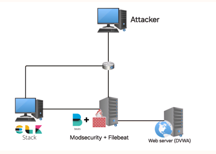
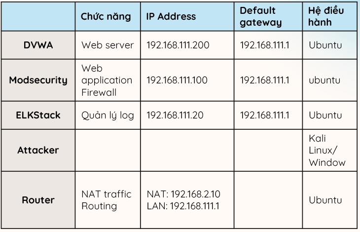
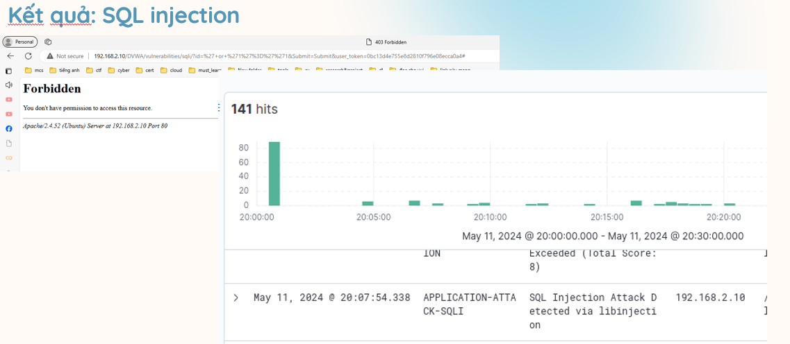
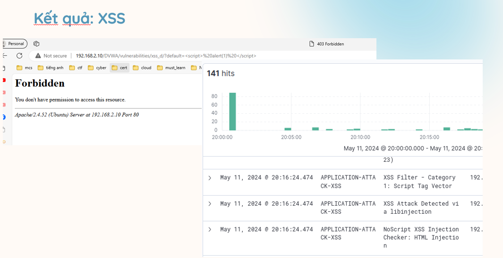
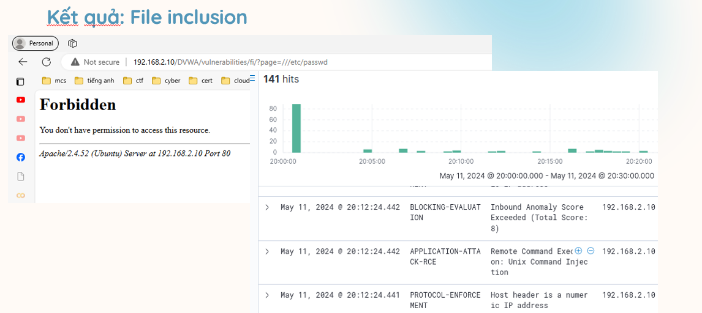

# WAF_ELK

# Dự án Bảo mật Ứng dụng Web

## Tổng quan
Dự án này tập trung vào việc triển khai ModSecurity như một Web Application Firewall (WAF) ở chế độ reverse proxy để bảo vệ các ứng dụng web như DVWA. Các mục tiêu chính bao gồm:
- Hiểu biết về các tính năng của WAF.
- Khám phá các cuộc tấn công OWASP Top 10.
- Nghiên cứu các công cụ kiểm thử lỗ hổng ứng dụng web.
- Tiến hành các cuộc tấn công mô phỏng để đánh giá hiệu quả của ModSecurity.
- Tích hợp ELK stack để cải thiện quản lý và phân tích log.

## Phạm vi công việc
- Triển khai ModSecurity như WAF ở chế độ reverse proxy.
- Bảo vệ ứng dụng web (DVWA).
- Hiểu biết về tính năng của WAF và khám phá OWASP Top 10.
- Nghiên cứu công cụ kiểm thử lỗ hổng và tiến hành các cuộc tấn công mô phỏng.
- Tích hợp ELK stack để quản lý và phân tích log.

## Hướng tiếp cận
- Xác định khả năng tích hợp ModSecurity như một WAF reverse proxy và đánh giá tài nguyên cần thiết.
- Hiểu rõ tính năng của WAF và cấu hình ModSecurity để chống lại OWASP Top 10 và các cuộc tấn công khác.
- Đánh giá khả năng ngăn chặn của ModSecurity bằng cách thực hiện các cuộc tấn công mô phỏng.
- Sử dụng ELK stack để quản lý và phân tích log từ ModSecurity.
- Cấu hình Logstash để thu thập log từ ModSecurity và sử dụng Filebeat để chuyển log vào Elasticsearch.
- Xây dựng các bảng điều khiển và báo cáo trong Kibana để giúp quản lý và theo dõi các hoạt động bảo mật.

## Giải pháp
- Các yêu cầu độc hại bị chặn bởi WAF.
- ModSecurity hoạt động như một WAF.
- Máy chủ proxy Apache được cấu hình.
- Ứng dụng web được lưu trữ trên máy chủ.
- Logs được tạo ra bởi WAF thông qua Apache và các logs ứng dụng.
- Beats: chuyển giao logs từ máy chủ đến Logstash.
- Logstash: một đường ống xử lý dữ liệu mã nguồn mở nhận dữ liệu từ nhiều nguồn.
- Elasticsearch: lưu trữ, tìm kiếm và phân tích dữ liệu dễ dàng ở quy mô lớn.
- Kibana: hiển thị dữ liệu từ Elasticsearch và cung cấp tùy chọn để cấu hình bảng điều khiển cho thông tin cần thiết.

## Triển khai
### Topology
- Hệ điều hành: Ubuntu
- Web server: DVWA
- Web application Firewall: Modsecurity
- Quản lý log: ELK Stack
- Attacker: Kali Linux/Windows
- Router: NAT traffic Routing
  
  

### Kịch bản tấn công
1. SQLi 

2. XSS

3. File inclusion 

## Cài đặt ModSecurity và ELK Stack

### Cài đặt ModSecurity
1. Cài đặt Apache:
    ```bash
    sudo apt update
    sudo apt install apache2
    ```
2. Cài đặt ModSecurity:
    ```bash
    sudo apt install libapache2-mod-security2
    sudo a2enmod security2
    ```
3. Cấu hình ModSecurity:
    ```bash
    sudo cp /etc/modsecurity/modsecurity.conf-recommended /etc/modsecurity/modsecurity.conf
    sudo nano /etc/modsecurity/modsecurity.conf
    ```
    - Tìm `SecRuleEngine` và thay đổi thành `On`.

4. Khởi động lại Apache:
    ```bash
    sudo systemctl restart apache2
    ```

### Cài đặt ELK Stack
1. Cài đặt Elasticsearch:
    ```bash
    wget -qO - https://artifacts.elastic.co/GPG-KEY-elasticsearch | sudo apt-key add -
    sudo apt-get install apt-transport-https
    echo "deb https://artifacts.elastic.co/packages/7.x/apt stable main" | sudo tee -a /etc/apt/sources.list.d/elastic-7.x.list
    sudo apt-get update && sudo apt-get install elasticsearch
    sudo systemctl enable elasticsearch
    sudo systemctl start elasticsearch
    ```
2. Cài đặt Logstash:
    ```bash
    sudo apt-get install logstash
    sudo systemctl enable logstash
    sudo systemctl start logstash
    ```

3. Cài đặt Kibana:
    ```bash
    sudo apt-get install kibana
    sudo systemctl enable kibana
    sudo systemctl start kibana
    ```

4. Cấu hình Filebeat để chuyển log vào Elasticsearch:
    ```bash
    sudo apt-get install filebeat
    sudo filebeat modules enable apache
    sudo filebeat setup
    sudo systemctl start filebeat
    sudo systemctl enable filebeat
    ```


